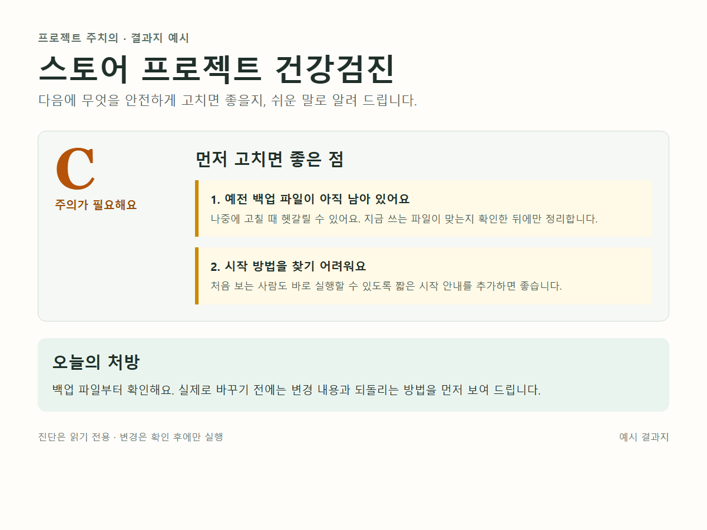
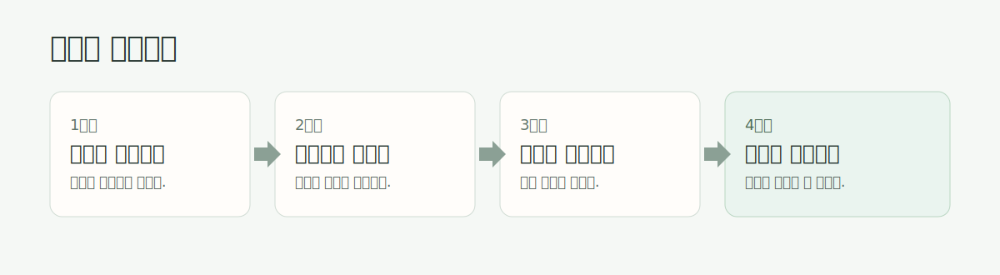

# 프로젝트 주치의 (Project Doctor)

**AI로 만들다 엉킨 프로젝트를, 비개발자도 읽을 수 있는 진단 보고서로 바꿔주는 Claude Code 스킬입니다.**
무엇이 문제인지 → 어디를 고치면 되는지 → 무엇부터 승인하면 되는지. 승인한 것만 고치고, 항상 되돌릴 수 있게.

[](https://github.com/Ps-Neko/project-doctor/actions/workflows/ci.yml)

> **언어:** 한국어로 대화하면 한국어 결과지, 영어로 대화하면 영어 결과지를 만듭니다. 기계 판독용 표시는 한국어로 유지됩니다. Docs: **[English README](./README.md)** · **한국어 (이 문서)**

📄 **[3분 데모 — 실제 진단 보고서 보기](./DEMO.md)** · 📊 **[측정 기록 (EVALS)](./EVALS.md)**



*한글 결과지 예시 — 실제로 바꾸기 전에, 다음에 할 안전한 조치를 먼저 설명합니다.*

> **현재 버전: v2.8.0 "영어 결과지 지원"** — 한국어·영어 결과지, 전 모드와 단골 기능(등급 추이 · 치료 부위 경과 확인 · 이번 주 처방 1건 · 검진 주기 안내), 처방 실행 전 변경 내용 미리보기, 쓰기 경계 자동 검사, 마크다운/HTML(클리니컬 결과지)/PDF(내장 브라우저 자동 변환)/워드 출력, 그리고 **HTML 결과지 보안 검증기**(허용목록 기반 태그·외부 리소스·비밀키 노출 검사)를 제공합니다. 변경 이력: [CHANGELOG](./skills/project-doctor/CHANGELOG.md) · 라이선스: [MIT](./LICENSE)

## 무엇을 해주나요

| 모드 | 언제 쓰나 | 무엇을 주나 |
|------|----------|------------|
| 🩺 **건강검진** `checkup` | "이 프로젝트가 왠지 마음에 안 들어" | 진단 카탈로그(기본 검진 22항목) 기반 문제 진단 → 승인한 항목만 치료 → **되돌리기 한 줄** 보장 |
| 🔬 **정밀 검진** `checkup --deep` | 더 깊게 보고 싶을 때 | + git 이력 핫스팟("이 파일 6회 수정됨") · 의존성 점검 · AI 작업물 문진 |
| 📋 **초진 차트** `intro` | "이게 뭔지부터 모르겠다" / 인수인계 | 프로젝트 지도(핵심 파일 5개) · 실행법 · 만지면 위험한 곳 |
| 🔀 **방향전환** `pivot` | "방향을 바꿀까 고민 중" | 갈림길 비교 → 유지/수정/폐기 분류 → "멈춰도 동작하는" 마일스톤 계획 |
| 🚀 **공개 전 검진** `release-check` | 공유·공개·납품 직전 | 비밀키(git 과거 기록 포함)·개인정보 점검 → 통과/보류 판정 |

보고서는 대화 언어를 따릅니다(한국어 대화=한국어 결과지, 영어 대화=영어 결과지 — v2.8.0). 항목마다 **"무슨 뜻인가요? / 어디? / 고치면? / 승인 명령"** 을 함께 줍니다.

## 실전 임상 사례

유명 오픈소스를 실제로 검진했습니다 — 모든 소견은 공개 전에 코드 대조로 재검증했습니다:

- **[left-pad — 인터넷을 멈춘 11줄](./docs/cases/case3-leftpad.md)** · 등급 🟢 B, ✅ 출하 가능 (영어 결과지)
- **[Moment.js — 은퇴한 거인의 검진](./docs/cases/case4-moment.md)** · 등급 🔴 D, 규모 가드 정직 발동 (영어 결과지)
- **[colors.js — 범행 현장에 들어간 검진](./docs/cases/case5-colors.md)** · 등급 🟡 C + 2022년 사보타주 코드를 카탈로그 밖 주의로 보고 (영어 결과지)
- [리액터 프로젝트 — 실제 D→C 치료기](./docs/cases/case1-reactor.md) (한국어) · [request — npm 전설의 부검](./docs/cases/case2-request.md) (한국어)

## ⚠️ 사용 전 꼭 알아두세요 (필수 고지)

1. **진단 시 프로젝트 내용이 Claude(Anthropic) 서버로 전송됩니다** (Claude Code의 기본 동작). 회사 기밀·고객 데이터가 포함된 프로젝트라면 회사의 AI 사용 정책을 먼저 확인하세요.
2. **비용**: 검진은 Claude 사용량(토큰)을 소모합니다. 정밀 검진(`--deep`)은 수 배 더 듭니다.
3. **검사 범위와 면책**: 진단 카탈로그에 정의된 알려진 패턴만 검사합니다. 보안 취약점 분석·법적 검토는 범위 밖이며, 결과에 대한 최종 판단과 책임은 사용자에게 있습니다.
4. **정적 분석 프로그램이 아닙니다**: 이 도구는 고정된 검사기가 아니라 Claude가 따르는 진단 절차(지시문)입니다. 같은 프로젝트라도 **모델 버전이나 프로젝트 구조에 따라 결과가 달라질 수 있습니다** (상세: [측정의 한계](./EVALS.md)).

## 설치

**방법 A — 한 줄 (내려받기+설치):**

**Windows (PowerShell):**

```powershell
git clone https://github.com/Ps-Neko/project-doctor.git; cd project-doctor; powershell -ExecutionPolicy Bypass -File install.ps1
```

**macOS / Linux:**

```bash
git clone https://github.com/Ps-Neko/project-doctor.git && cd project-doctor && bash install.sh
```

설치 스크립트가 `skills/project-doctor`를 `~/.claude/skills/`로 복사하고 **설치 인식 여부(SKILL.md·버전)까지 확인**합니다. 여러 번 실행해도 안전합니다(덮어쓰기 — 업데이트도 같은 명령). 끝나면 **Claude Code를 새로 시작**하면 `/project-doctor`가 인식됩니다.

- 설치하지 않고 **현재 상태만 점검**: `powershell -File install.ps1 -Check` (macOS/Linux: `bash install.sh --check`)

**방법 B — Claude Code 플러그인 (실험적):**

```
/plugin marketplace add Ps-Neko/project-doctor
/plugin install project-doctor@project-doctor
```

<details>
<summary>수동 설치 (스크립트 없이)</summary>

```powershell
New-Item -ItemType Directory -Force ~/.claude/skills
Copy-Item -Recurse -Force skills/project-doctor ~/.claude/skills/
```
macOS/Linux: `mkdir -p ~/.claude/skills && cp -r skills/project-doctor ~/.claude/skills/`

> 업데이트(재설치) 시에는 옛 파일이 남지 않도록 **먼저 기존 폴더를 지우세요** — Windows `Remove-Item -Recurse -Force ~/.claude/skills/project-doctor`, macOS/Linux `rm -rf ~/.claude/skills/project-doctor` (그다음 위 복사). 자동 스크립트(`install.ps1`/`install.sh`)는 이 과정을 알아서 합니다.
</details>

## 사용법

```
/project-doctor                      # 뭘 할지 모르면 — 접수 문진이 안내합니다
/project-doctor checkup "<경로>"      # 건강검진 (한글·공백 경로는 따옴표)
/project-doctor checkup --deep       # 정밀 검진
/project-doctor intro                # 초진 차트 (해설·인수인계)
/project-doctor pivot "<목표>"        # 방향전환 계획
/project-doctor release-check        # 공개 전 검진
```

## 이렇게 사용해요



먼저 결과지를 받고, 바꿀지 말지는 한 가지씩 직접 결정합니다.

## 안전장치 (설계 원칙)

1. **진단은 읽기 전용** — 보고서가 나오기 전에는 아무것도 고치지 않습니다
2. **승인한 것만 실행** — 한 번에 하나씩, 실행 전 "무엇이 바뀌는지" 목록 제시
3. **항상 되돌릴 수 있게** — 실행 전 체크포인트(git 또는 백업), 실행 후 되돌리기 명령 한 줄 제공. 되돌릴 방법이 없으면 실행하지 않습니다
4. **이력 기억** — 승인 시 `.project-doctor/`에 진료 기록을 남겨 다음 검진에서 "지난번보다 좋아졌는지" 비교

## 저장소 구성

```
skills/project-doctor/   ← 설치되는 스킬 본체 (SKILL.md + 참조 문서 8개)
tests/                   ← 품질 측정 도구: 채점 스크립트 + pytest
tests/fixtures/          ← 일부러 문제를 심은 테스트 프로젝트 4종 + 정답지
SPEC.md / PLAN.md        ← 이 스킬의 명세와 구현 계획 (개발 과정 기록)
```

> ⚠️ `tests/fixtures/`의 비밀키·개인정보는 **전부 실존하지 않는 가짜**입니다 (스킬의 탐지 능력을 측정하기 위한 표본 — [tests/fixtures/README.md](./tests/fixtures/README.md) 참고).

## 품질 근거

- 검진 탐지율: **내부 표본(픽스처) 기준** — 독립 세션 측정에서 정답지 14건 대비 3회 연속 100% (합격선: 3회 최저치 80%) — *정식 신선 3회 측정은 v1.0.0 시점이며, 이후 버전은 진단 카탈로그·채점기·픽스처 무변경으로 매 CI 회귀를 통과합니다(신선 3회 재측정은 다음 모델 메이저 업데이트 시 — [EVALS의 한계 절](./EVALS.md))*
- 비밀키 탐지: **내부 표본 기준** — 가짜 키 표본 3회 연속 100% + 오탐 0건 (합격선: 100% — 놓친 1건이 곧 사고) — *측정은 v2.0.1 시점이며, 이후 SEC-01 패턴 확장(v2.7.6)은 표본 8건에 미사용이라 8/8 불변*
- 모든 측정은 사람의 "감"이 아닌 **정답지(EXPECTED.md) ↔ 보고서 ID 기계 대조**로 수행 — 정답지에 없는 ID가 보고되면 오탐으로 자동 미달 처리(v2.0.1부터)
- 알아두실 것: 채점은 ID 일치 기준(위치 정확성은 별도 정성 확인)이고, 진단 절차는 코드가 아니라 AI가 따르는 지시문이라 **모델이 바뀌면 결과가 달라질 수 있습니다** — 그래서 분기 1회·모델 업데이트 시 재측정을 원칙으로 합니다. 상세: [EVALS의 한계 절](./EVALS.md)
