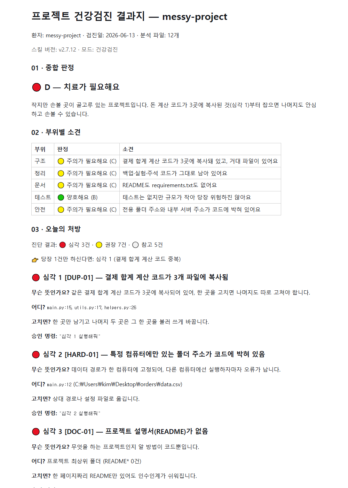

# Project Doctor (프로젝트 주치의)

**A Claude Code skill that turns your messy AI-built project into a diagnosis report a non-developer can actually read.**
What is wrong → where to fix it → what to approve first. It only changes what you approve, and every change comes with a one-line undo.

[](https://github.com/Ps-Neko/project-doctor/actions/workflows/ci.yml)

> **Note: diagnosis reports can now be generated in Korean or English.** Korean remains the original default for Korean conversations; English conversations use the English report template. Machine-readable grader markers stay in Korean by design. Docs: **English (this file)** · **[한국어 README](./README.ko.md)**

**[3-minute demo — see a real diagnosis report](./DEMO.md)** · **[Measurement records (EVALS)](./EVALS.md)**



Current version: **v2.8.0** <!-- 현재 버전: v2.8.0 (machine-readable marker for tests/check_version.py) --> — Korean and English diagnosis reports, all modes + returning-patient features (grade trend "May D → today C", treated-area follow-up, one prescription per visit, checkup interval guidance), pre-execution change preview, write-boundary auto check, reports as Markdown / HTML ("clinical" report design) / PDF (auto-converted via your local browser) / Word, plus an HTML report security verifier (allowlist-based tag / external-resource / secret-leak machine checks). Changelog: [CHANGELOG](./skills/project-doctor/CHANGELOG.md) · License: [MIT](./LICENSE)

## What it does

| Mode | When | What you get |
|------|------|--------------|
| **Checkup** `checkup` | "Something feels wrong with this project" | Diagnosis against a fixed catalog (22 base checks) → treat only approved items → **one-line undo** guaranteed |
| **Deep checkup** `checkup --deep` | You want to look deeper | + git history hotspots ("this file changed 6 times"), dependency review, AI-artifact questionnaire |
| **Intro chart** `intro` | "I don't even know what this is" / handover | Project map (5 key files), how to run it, where not to touch |
| **Pivot** `pivot` | "Should I change direction?" | Compare paths → keep / modify / drop classification → milestones that still run if you stop |
| **Release check** `release-check` | Right before sharing / shipping | Secrets (including git history) and PII scan → pass / hold verdict |

Every report explains each finding with **"What does it mean? / Where? / If fixed? / Approval command"** in English reports, with the matching plain-language Korean labels in Korean reports.

## Real-world clinical cases

Famous open-source projects, actually checked up — every finding re-verified against the code before publication:

- **[left-pad — the 11 lines that broke the internet](./docs/cases/case3-leftpad.md)** · grade 🟢 B, ✅ ready to ship (English report)
- **[Moment.js — checkup of a retired giant](./docs/cases/case4-moment.md)** · grade 🔴 D, size guard engaged honestly (English report)
- **[colors.js — the checkup that walked into a crime scene](./docs/cases/case5-colors.md)** · grade 🟡 C, plus an out-of-catalog caution on the 2022 sabotage code (English report)
- [Reactor project — a real D→C treatment story](./docs/cases/case1-reactor.md) (Korean) · [request — autopsy of an npm legend](./docs/cases/case2-request.md) (Korean)

## Before you use it (required disclosure)

1. **Your project content is sent to Claude (Anthropic) servers** — that is how Claude Code works. Check your company's AI policy before running this on confidential code.
2. **Cost**: checkups consume Claude tokens. `--deep` costs several times more.
3. **Scope and disclaimer**: only known patterns defined in the diagnosis catalog are checked. Security vulnerability analysis and legal review are out of scope. Final judgment and responsibility stay with you.
4. **This is not a static analyzer**: it is a diagnostic procedure (instructions) that Claude follows. Results can vary with model versions and project structure (details: [limits of measurement](./EVALS.md)).

## Install

**Option A — one line (clone + install):**

Windows (PowerShell):

```powershell
git clone https://github.com/Ps-Neko/project-doctor.git; cd project-doctor; powershell -ExecutionPolicy Bypass -File install.ps1
```

macOS / Linux:

```bash
git clone https://github.com/Ps-Neko/project-doctor.git && cd project-doctor && bash install.sh
```

The script copies `skills/project-doctor` into `~/.claude/skills/`, then verifies the install (SKILL.md presence + version). Safe to re-run — updating uses the same command. Restart Claude Code and `/project-doctor` is recognized.

- Check current install state without installing: `powershell -File install.ps1 -Check` (macOS/Linux: `bash install.sh --check`)

**Option B — Claude Code plugin (experimental):**

```
/plugin marketplace add Ps-Neko/project-doctor
/plugin install project-doctor@project-doctor
```

<details>
<summary>Manual install (no script)</summary>

```powershell
New-Item -ItemType Directory -Force ~/.claude/skills
Copy-Item -Recurse -Force skills/project-doctor ~/.claude/skills/
```

macOS/Linux: `mkdir -p ~/.claude/skills && cp -r skills/project-doctor ~/.claude/skills/`

> When updating manually, **delete the old folder first** so stale files do not survive: Windows `Remove-Item -Recurse -Force ~/.claude/skills/project-doctor`, macOS/Linux `rm -rf ~/.claude/skills/project-doctor`, then copy again. The install scripts do this for you.
</details>

## Usage

```
/project-doctor                      # not sure where to start — intake will guide you
/project-doctor checkup "<path>"     # health checkup (quote paths with spaces/Korean)
/project-doctor checkup --deep       # deep checkup
/project-doctor intro                # intro chart (explanation / handover)
/project-doctor pivot "<goal>"       # pivot plan
/project-doctor release-check        # pre-release check
```

## Safety by design

1. **Diagnosis is read-only** — nothing changes before the report is out
2. **Only approved items run** — one at a time, with a "what will change" preview first
3. **Always undoable** — checkpoint (git or backup) before execution, one-line undo after; if it cannot be undone, it does not run
4. **It remembers** — approved treatments are recorded in `.project-doctor/`, so the next checkup can tell you whether things actually got better

## Repository layout

```
skills/project-doctor/   ← the skill that gets installed (SKILL.md + 8 reference docs)
tests/                   ← quality tooling: scoring scripts + pytest
tests/fixtures/          ← test projects with planted problems + answer keys
SPEC.md / PLAN.md        ← the skill's spec and build log
```

> All secrets/PII inside `tests/fixtures/` are **fake by design** — planted samples for measuring detection ([tests/fixtures/README.md](./tests/fixtures/README.md)).

## Quality evidence (honest version)

- Detection rate: **internal fixture baseline** — 3 consecutive independent-session runs at 100% against a 14-item answer key (pass bar: worst-of-3 ≥ 80%). Formal fresh 3-run measurement dates to v1.0.0; later versions keep catalog/scorer/fixtures unchanged and pass CI regression on every commit ([limits](./EVALS.md)).
- English reports (v2.8.0): measured on **2 fresh official English runs (+1 pilot) plus 1 Korean regression run**, all passing format 0 / score 14-of-14 / false-positives 0 / location 5-of-5 — a smaller sample than the 3-run standard; model-generated reports are non-deterministic, so a small-sample pass can still be lucky ([limits](./EVALS.md)).
- Secret detection: **internal baseline** — fake-key samples, 3 consecutive 100% with 0 false positives (pass bar: 100% — one miss is an incident).
- All measurement is **machine comparison of report IDs against answer keys** (EXPECTED.md), not human impressions; reporting an ID not in the key counts as an automatic fail.
- Know this: scoring is ID-match based, the procedure is AI-followed instructions, and **results can change when models change** — which is why re-measurement is scheduled per quarter / per major model update ([EVALS](./EVALS.md)).
